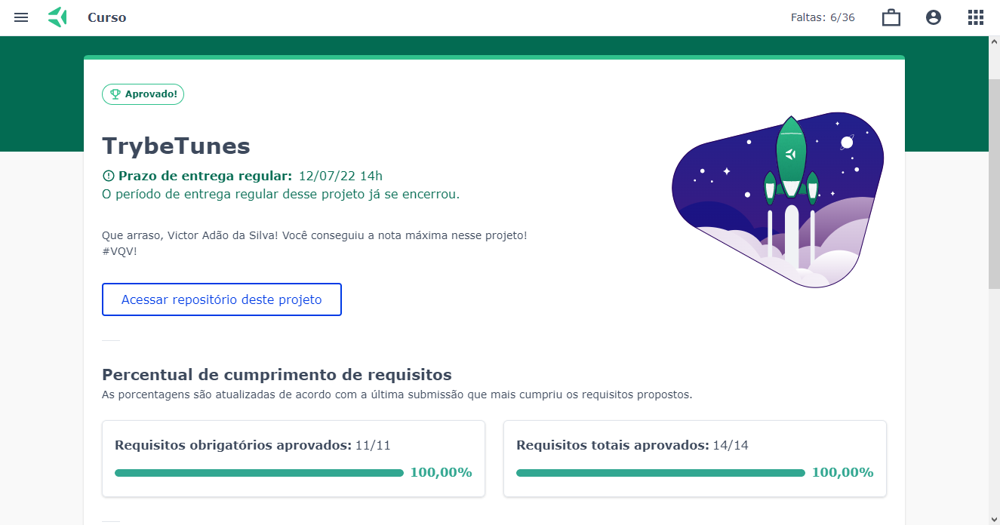

# Projeto-TrybeTunes

🔰Como iniciar o projeto na sua máquina🔰

- ``` git clone git@github.com:VictorSilva27/Projeto-TrybeTunes.git ``` (Clonar o repositório no local)
- ``` cd Projeto-TrybeTunes ``` (Entrar no repositório clonado)
- ``` npm install ``` (Baixando as dependências)
- ``` npm start ``` (Iniciando projeto)


